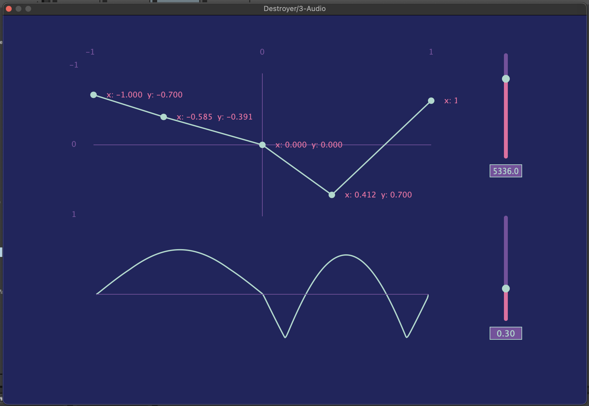

# Destroyer

A project to fiddle around with distortion as a lookup table defined with a translation graph.
Input is x axis, and output is y axis. 

For now still no oversampling or properly anti-aliasing.
Still in developement... 

Drag the nodes in the graph to transform the output. 
Sine wave below is trying to visualize what the output is like. 
Sliders to the left are lowpass moog filter with a slider for frequency cutoff and resonnance. 

