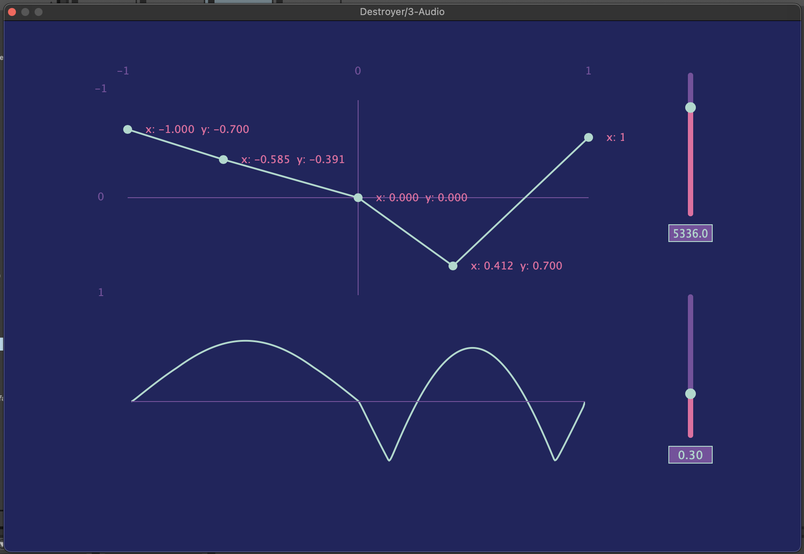

# Destroyer

A prototype project for now to fiddle around with distortion as a lookup table defined with a translation graph. Nothing fancy and all with linear interpolation and 2x oversampling for less aliasing. Still missing dc blocking hi pass and tweaking.

Input is x axis, and output is y axis.

Drag the nodes in the graph to transform the output. 
Sine wave below is trying to visualize what the output is like. 
Sliders to the left are lowpass moog filter with a slider for frequency cutoff and resonnance. 

